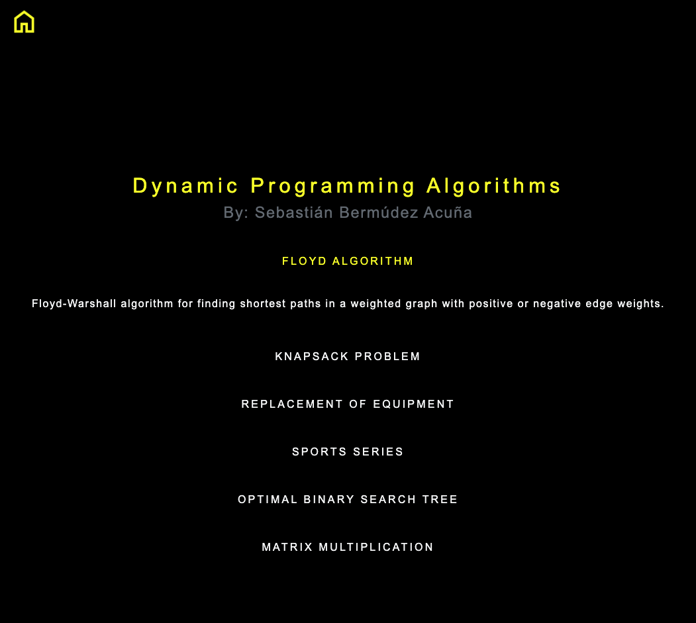

# OR-Algorithms
This is a web application, built in Angular v. 17, that solves some operations research's algorithms. The algorithms are:
- Floyd Algorithm
- Knapsack Problem
- Replacement Of Equipment
- Sports Series
- Optimal Binary Search Tree
- Matrix Multiplication

Here it is the view of the main page:

## Testing
You can check the `assets/tests` folder for testing each algorithm. The `tests.txt` file includes sample input for each of the algorithms, including the reference for each of the *csv* files required for a determined exercise.
